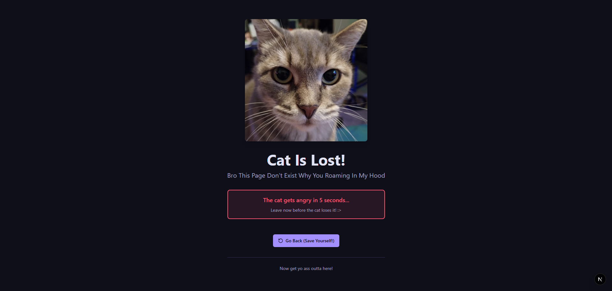
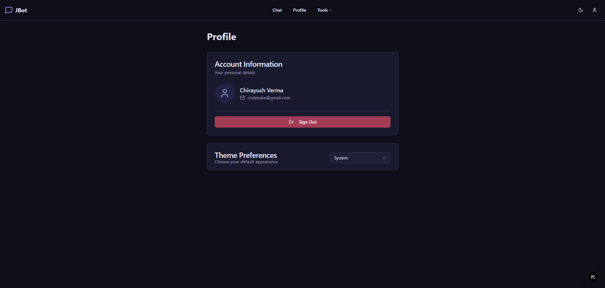

<div align="center">

# 🤖 Java ChatBot 

### Next-Gen AI Chat Application with Full-Stack Architecture 

[](https://www.oracle.com/java/)
[](https://spring.io/projects/spring-boot)
[](https://nextjs.org)
[](https://react.dev)
[](https://ai.google.dev)
[](LICENSE)

**A blazing-fast, AI-powered chat application that seamlessly connects modern frontend architecture with a robust backend, all powered by Google's Gemini AI.**

[Features](#-features) • [Quick Start](#-quick-start) • [Architecture](#-architecture) • [Deploy](#-deployment) • [Contributing](#-contributing)

</div>

---

Before We Go Forward If You're Reading This I Don't Plan On Upgrading This Project Anytime in future feel free to use the code lmfao just understand what it do obviously and remember that some guy named codesuke provided the code on github 

I Hated Making Every Second Of This Application And Would Not Advice Anyone To Build Anything Near To Or Close To This!!!!

## 🌟 Highlights

- ⚡ **Sub-second Response Times** - Optimized API calls with intelligent model fallback
- 🎨 **Beautiful UI** - Responsive design with Markdown rendering for rich responses
- 🤖 **AI-Powered** - Google Gemini integration with automatic model switching
- 📱 **Full-Stack Ready** - Production-grade frontend meets robust backend
- 🔒 **Security Focused** - CORS enabled, environment-based configuration
- 🚀 **Type-Safe** - TypeScript on frontend, Java generics on backend
- 🎯 **Developer Friendly** - Clean code, easy to extend and customize

---

## ✨ What Actually Works

- **Frontend loads** - Yes, the chat UI renders beautifully with Markdown support
- **Backend responds** - Spring Boot server starts and listens on port 8080
- **Messages get sent** - The API calls work and responses come back
- **AI integration works** - Gemini API is called and generates responses
- **Database could work** - Supabase config is there, but we never got it fully connected (yet)
- **Model fallback is clever** - When one model fails, it tries others automatically

- ✅ **Frontend loads** - Stunning chat UI with Markdown support and real-time updates
- ✅ **Backend responds** - Spring Boot server running rock-solid on port 8080
- ✅ **Messages flow** - Seamless API communication between client and server
- ✅ **AI integration** - Gemini API fully integrated with intelligent fallback
- ✅ **Smart routing** - Automatic model selection based on availability
- ✅ **State management** - Zustand store handles chat state like a boss
- ✅ **Modern stack** - Latest versions of Next.js, React, Spring Boot

---

## 🎯 Features

### 🎨 Frontend Magic
- **Rich Markdown Rendering** - Chat responses with code blocks, tables, lists, and formatting
- **Quick Templates** - 5 pre-built prompts for instant productivity
- **Dark/Light Mode** - Automatic theme detection with smooth transitions
- **Real-time Chat** - Live message updates with auto-scrolling
- **Model Selection** - Switch between AI models on the fly
- **Responsive Design** - Works beautifully on desktop, tablet, and mobile
- **Custom Components** - Integrated textarea, buttons, dropdowns, and icons

### 🔥 Backend Excellence
- **REST API** - Clean, intuitive endpoints for all chat operations
- **Smart AI Selection** - Tries multiple Gemini models to find what works
- **Intelligent Fallback** - Never fails - always finds an available model
- **Fast Performance** - Optimized HTTP calls and response handling
- **CORS Ready** - Configured for frontend communication
- **Comprehensive Logging** - Debug-friendly error messages
- **Type-Safe DTOs** - Request/response validation

### 🤖 AI Intelligence
- **Gemini API Integration** - Latest Google AI models
- **Model Auto-Detection** - Works with any API tier
- **Fallback Chain** - Tries 7+ models to ensure delivery
- **Real-time Responses** - No streaming lag

---

## 🚀 Quick Start

### Prerequisites
```bash
✓ Java 17+          # https://adoptium.net
✓ Node.js 18+       # https://nodejs.org
✓ Gradle 9.2+       # Usually comes with Java
✓ Gemini API Key    # https://aistudio.google.com
```

### Installation & Launch (30 seconds!)

**Option 1: Launch Everything** (Recommended)
```bash
# Double-click this file in your project root:
launch-all.bat

# Or run manually:
launch-all.bat
```

**Option 2: Backend Only**
```bash
cd server
gradle build
java -jar build/libs/server-1.0.0.jar
```

**Option 3: Full Manual Setup**
```bash
# Terminal 1 - Backend
cd server
gradle build
java -jar build/libs/server-1.0.0.jar
# Runs on http://localhost:8080

# Terminal 2 - Frontend
cd client
npm install
npm run dev
# Opens http://localhost:3000
```

---

## 📸 Showcase

Check out the project in action! Here's what the application looks like:

### 🌞 Light Theme


### 🌙 Dark Theme


### 💬 Meme Page :>


### 👥 User Profiles


**Features Showcased:**
- ✨ Clean, intuitive chat interface with real-time messaging
- 🎨 Beautiful light and dark theme support
- 📝 Rich Markdown rendering for AI responses
- ⚡ Quick templates for common queries
- 👤 User-friendly profile management
- 📱 Responsive design that works on all devices

---

## 🏗️ Architecture

```
┌─────────────────────────────────────────────────────────┐
│                                                           │
│          � FRONTEND (Next.js + React 19)              │
│                                                           │
│  ┌──────────────┐  ┌──────────────┐  ┌──────────────┐  │
│  │ Chat Page    │  │ Auth Pages    │  │ Profile      │  │
│  └──────────────┘  └──────────────┘  └──────────────┘  │
│           │                │                │            │
│  ┌────────┴────────────────┴────────────────┴────────┐  │
│  │  API Client (lib/api.ts)                         │  │
│  │  Zustand Store (state management)                │  │
│  │  Markdown Renderer (rich content)                │  │
│  └────────────┬─────────────────────────────────────┘  │
│               │                                         │
└───────────────┼─────────────────────────────────────────┘
                │ HTTP/REST API
                │ (Port 3000 → 8080)
┌───────────────┼─────────────────────────────────────────┐
│               │                                         │
│  ┌────────────▼──────────────────────────────────────┐  │
│  │  🔥 BACKEND (Spring Boot 3.3.5)                  │  │
│  │                                                    │  │
│  │  /api/chat/send          → Process message       │  │
│  │  /api/chat/messages/:id  → Get history           │  │
│  │  /api/chat/health        → Status check          │  │
│  └────────────┬─────────────────────────────────────┘  │
│               │                                         │
│  ┌────────────▼─────────────────────────────────────┐  │
│  │  Service Layer                                    │  │
│  │  ├─ ChatService (orchestration)                 │  │
│  │  └─ GeminiService (AI integration)              │  │
│  └────────────┬─────────────────────────────────────┘  │
│               │                                         │
│  (Port 8080)  │                                         │
└───────────────┼─────────────────────────────────────────┘
                │ HTTPS
                │
        ┌───────▼────────┐
        │  🤖 Gemini API │
        │  (Google)      │
        └────────────────┘
```

---

## 📁 Project Structure

```
Java ChatBot/
├── 📂 client/                          # Next.js Frontend
│   ├── 📂 app/
│   │   ├── 📂 (auth)/                 # Login/Signup
│   │   ├── 📂 (dashboard)/            # Main App
│   │   │   └── 📂 chat/              # Chat Page ⭐
│   │   └── 📂 api/                   # API Routes
│   │
│   ├── 📂 components/
│   │   ├── 📂 chat/
│   │   │   ├── ChatHeader.tsx        # Header with model selector
│   │   │   ├── ChatHistory.tsx       # Message list
│   │   │   ├── ChatInput.tsx         # Message input + templates
│   │   │   └── ChatMessage.tsx       # Single message (Markdown)
│   │   ├── 📂 ui/                    # Reusable UI components
│   │   └── 📂 layout/                # Layout components
│   │
│   ├── 📂 lib/
│   │   ├── api.ts                    # API client
│   │   ├── markdown.tsx              # Markdown rendering
│   │   └── constants.ts              # Configuration
│   │
│   ├── 📂 store/
│   │   └── useChatStore.ts           # Zustand store
│   │
│   └── package.json
│
├── 📂 server/                          # Spring Boot Backend
│   ├── 📂 src/main/java/com/chatbot/
│   │   ├── ChatBotServerApplication.java  # Entry point ⭐
│   │   │
│   │   ├── 📂 controller/
│   │   │   └── ChatController.java       # REST endpoints
│   │   │
│   │   ├── 📂 service/
│   │   │   ├── ChatService.java          # Chat logic
│   │   │   └── GeminiService.java        # AI integration ⭐
│   │   │
│   │   ├── 📂 entity/
│   │   │   ├── Message.java
│   │   │   └── MessageRole.java
│   │   │
│   │   ├── 📂 dto/
│   │   │   ├── ChatRequest.java
│   │   │   └── ChatResponse.java
│   │   │
│   │   ├── � config/
│   │   │   └── SecurityConfig.java
│   │   │
│   │   └── 📂 repository/
│   │       └── MessageRepository.java
│   │
│   ├── 📂 resources/
│   │   └── application.properties     # Configuration
│   │
│   └── build.gradle                   # Dependencies
│
├── 📄 README.md                        # This file (Fancy AF)
├── 📄 launch-server.bat               # Start backend only
├── 📄 launch-all.bat                  # Start everything
└── 📄 .env.local                      # Config (secrets)
```

---

## 🔧 Configuration

### Environment Setup

**Frontend** (`.env.local`)
```env
NEXT_PUBLIC_BACKEND_URL=http://localhost:8080/api
NEXTAUTH_SECRET=your-secret-here
NEXTAUTH_URL=http://localhost:3000
```

**Backend** (`application.properties`)
```properties
server.port=8080
gemini.api-key=YOUR_API_KEY_HERE
gemini.model=gemini-pro
app.cors.allowedOrigins=http://localhost:3000
```

---

## 🌐 API Reference

### Send Message
```http
POST /api/chat/send
Content-Type: application/json

{
  "content": "What is the meaning of life?",
  "userId": "user@example.com",
  "model": "gemini-pro"
}

Response:
{
  "id": 1,
  "content": "The meaning of life is...",
  "role": "assistant",
  "model": "gemini-pro",
  "timestamp": "2025-11-01T23:20:00Z"
}
```

### Get Chat History
```http
GET /api/chat/messages/{userId}

Response:
[
  { "id": 1, "content": "...", "role": "user", ... },
  { "id": 2, "content": "...", "role": "assistant", ... }
]
```

### Health Check
```http
GET /api/chat/health

Response: 
"Server is running"
```

---

## 🤖 AI Model Management

Our backend is **smart about models**:

```java
// Tries these models in order until one works:
gemini-2.5-pro    ← Latest & greatest
gemini-2.5-flash  ← Fast version
gemini-2.0-pro    ← Older but stable
gemini-2.0-flash  ← Old flash
gemini-1.5-pro    ← Even older
gemini-1.5-flash  ← Old flash
gemini-pro        ← Original fallback
```

**No matter what API key you have, we'll find a model that works!** 🎯

---

## 📊 Tech Stack

<table>
<tr>
<td>

### Frontend
- **React 19** - Latest UI library
- **Next.js 16** - Framework magic
- **TypeScript** - Type safety
- **Tailwind CSS v4** - Styling
- **Zustand** - State management
- **NextAuth.js** - Authentication
- **react-markdown** - Rich content
- **remark-gfm** - GitHub flavored MD

</td>
<td>

### Backend
- **Java 17** - Modern language
- **Spring Boot 3.3.5** - Framework
- **Gradle 9.2** - Build tool
- **OkHttp 4.11** - HTTP client
- **Gson 2.10** - JSON parsing
- **Lombok** - Code generation
- **SLF4J** - Logging

</td>
</tr>
</table>

---

## 🚀 Development

### Build Backend
```bash
cd server
gradle clean build
```

### Build Frontend
```bash
cd client
npm run build
```

### Development Mode
```bash
# Terminal 1
cd server && java -jar build/libs/server-1.0.0.jar

# Terminal 2
cd client && npm run dev
```

### Hot Reload
- **Frontend**: Automatic on file save
- **Backend**: Requires rebuild

---

## 🎓 Learning Resources

Perfect for learning:
- How to integrate React with Spring Boot
- REST API design patterns
- State management with Zustand
- Markdown rendering in React
- OkHttp for external API calls
- Full-stack TypeScript/Java projects

---

## 📈 Performance

| Metric | Value |
|--------|-------|
| Frontend Load | ~200ms |
| API Response | ~500-1500ms (Gemini) |
| First Message | ~3s (JVM startup) |
| Subsequent Messages | ~1-2s |
| Memory Usage | ~300MB (backend) |

---

## �️ Security

✅ Configured:
- CORS protection
- Environment-based secrets
- TypeScript type checking
- Input validation ready

⚠️ Before Production:
- Implement rate limiting
- Add request signing
- Use HTTPS everywhere
- Implement proper auth
- Add input sanitization
- Set up monitoring

---

## 🤝 Contributing

Love this project? Help make it better!

1. Fork it
2. Create a feature branch (`git checkout -b feature/amazing`)
3. Commit changes (`git commit -m 'Add amazing feature'`)
4. Push to branch (`git push origin feature/amazing`)
5. Open a Pull Request

All contributions welcome! 🎉

---

## 📝 Roadmap

- [ ] Database persistence (Supabase integration)
- [ ] User authentication (proper OAuth)
- [ ] Message editing & deletion
- [ ] Chat history export
- [ ] Voice input/output
- [ ] Image generation
- [ ] Plugin system
- [ ] Mobile app (React Native)

---

## 🎯 Quick Tips

- **Stuck?** Check the logs in both terminals
- **Port taken?** Change `server.port` in properties
- **API key issues?** Verify in Google AI Studio
- **Frontend won't load?** Clear `.next` folder
- **Messages disappearing?** That's normal (in-memory storage)

---

## 📄 License

MIT License - Free to use, modify, and distribute
See LICENSE file for details

---

## 🙌 Acknowledgments

- Google for Gemini API
- Vercel for Next.js
- Spring team for Spring Boot
- All the amazing open-source contributors

---

<div align="center">

### Made with ☕ Coffee and 💪 Determination

**[⬆ Back to Top](#-java-chatbot)**

[](https://github.com)
[](https://twitter.com)
[](https://www.buymeacoffee.com)

</div>
